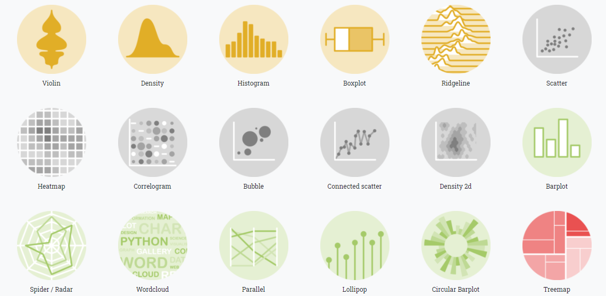
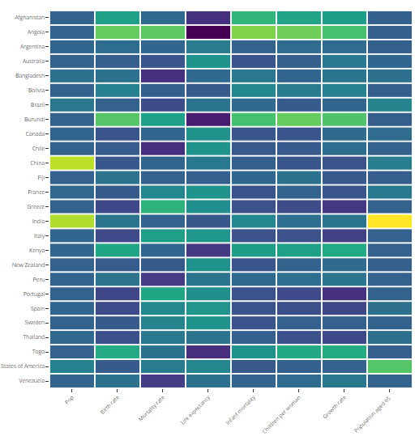
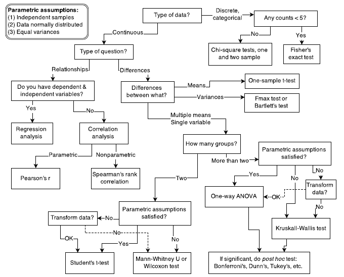

```{r setup, include=FALSE}
options(htmltools.dir.version = FALSE)
```

```{r xaringan-themer, include=FALSE, warning=FALSE}
library(xaringanthemer)
style_duo_accent(
  primary_color = "#1381B0",
  secondary_color = "#FF961C",
  inverse_header_color = "#FFFFFF"
)
```

# 👋 Hi! 

.pull-left[

## So what's the secret?

Research is not about which tool you use or which statistical test you use. It's all about principles of looking at your data and understanding variation in your data.

]

.pull-right[

## Presentation content

1. Storing your data

1. Exploring the data

1. Choosing tables and figures

1. Choosing statistical tests

1. Reporting statistical tests
]


---

# Before you even start...

Three principles of tidy data:


1. Each variable must have its own column.
1. Each observation must have its own row.
1. Each value must have its own cell.


In case of concurrent diseases, multiple responses in questionnaires, it's better to use more columns or more rows to store your data.

---

# Further reading on tidy data

1. Kara Woo, [Data Organization in Spreadsheets](https://www.tandfonline.com/doi/full/10.1080/00031305.2017.1375989)
2. Hadley Wickham, [R for Data Science](https://r4ds.had.co.nz/)

---


# Exploratory Data Analysis

Exploring your data can be done in a variety of ways but in 95% you usually want to:


1. Create histograms of continuous variables
1. Create counts of categorical variables
1. Create scatterplots of two continuous variables


---

# Histograms

A histogram is a type of plot that places your numeric data into bins or intervals.

```{r, warning = F, message = F, fig.height=4}

library(ggplot2)
library(tidyverse)
library(palmerpenguins)

ggplot(penguins, aes(x = bill_length_mm)) + geom_histogram()

```

---

# Counting categorical variables

Creating count tables lets you see how many unique values you actually have in a column and whether there were any data entry errors, resulting in unexpected counts.

```{r}

penguins %>% count(island)

```

---

# Scatterplots

A scatterplot is a two-dimensional plot that shows the distribution of two numeric variables against each other.

```{r, fig.height=4, message = F, warning = F}

ggplot(penguins, aes(x = bill_length_mm, y = body_mass_g)) + 
  geom_point()

```

---

# Anscombe's Quartet


---

# Simpson's Paradox

.pull-left[

Something seems off...

```{r, fig.height = 6, echo = FALSE, warning = FALSE, message = FALSE}

ggplot(penguins, aes(x = bill_length_mm, y = bill_depth_mm)) + 
  geom_point() + 
  geom_smooth(se = FALSE, method = "lm")


```


]

.pull-right[

...that's because it is!

```{r, fig.height = 6, echo = FALSE, warning = FALSE, message = FALSE}

ggplot(penguins, aes(x = bill_length_mm, y = bill_depth_mm, fill = species, color = species)) + 
  geom_point() + 
  geom_smooth(se = FALSE, method = "lm")


```


]

---

# Table 1

"Table 1" is a table in a paper that summarises the key variables in your dataset. An example using the `gtsummary` package in R:

```{r message = F, warning = F, echo = FALSE}

library(gtsummary)

trial %>% 
  select(age, grade, response, trt) %>% 
  tbl_summary(
    by = trt, # split table by group
    missing = "no" # don't list missing data separately
  )


```

---

# Further reading on tables

1. [Who is in this study, anyway? Guidelines for a useful Table 1](https://www.sciencedirect.com/science/article/abs/pii/S0895435618309867)
1. [gtsummary package](http://www.danieldsjoberg.com/gtsummary/)

---

# Figures!

Any modern piece of software can prepare a nice chart - it's all a matter of knowing which one to use!

```{r, echo = FALSE}



```

---

# Plotting numeric variables on categories

```{r, fig.height=4, warning = F}

ggplot(penguins, aes(x = species, y= body_mass_g, fill = species)) + 
  geom_boxplot()

```

---

# Hold up, what's a boxplot?

```{r, echo = F}

knitr::include_graphics("stats-on-short-notice_files/boxplot-1.png")

```

---

# Categorical data

.pull-left[

You could do a heatmap...

```{r, echo = FALSE}



```


]

.pull-right[

...but usually it's a bar chart.

```{r, fig.height=4}

ggplot(penguins, aes(x = species)) + 
  geom_bar()

```

]

---

# Further resources on charts

1. [Data to Viz](https://www.data-to-viz.com/)
2. [ggplot2 book](https://ggplot2-book.org/)
3. [Data Visualization: a Practical Introduction](https://socviz.co/)
4. [R Graphics Cookbook](https://r-graphics.org/)

---

# Can I please do statistics now?

If your research question is simple enough, consult the flowchart and go nuts!

```{r, echo = FALSE, fig.height=3}



```

---

# What if I would like to do some "real" statistics?

.pull-left[

* What are you trying to estimate?
* Learn about linear models - robust in most cases
* Consult heavily any of the resources in the references!

]


.pull-right[


]

---

# General guidelines for presenting statistics

.pull-left[

* If the p value is larger than 0.001, always report an exact value
* Report any additional summary statistics along with the p value (e.g. Student's t value)
* If doing ANOVA, t-test, ALWAYS report the mean difference and the 95% confidence interval

]

.pull-right[

`r knitr::include_graphics("stats-on-short-notice_files/E3m7DLYUYAkwlwK.jpg")` 

]

---

# More References!

1. [RCompanion](https://rcompanion.org/rcompanion/index.html)
2. [Learning Statistics with R](https://learningstatisticswithr.com/lsr-0.6.pdf)
3. [Report package](https://github.com/easystats/report)
4. [All tests are linear tests](https://lindeloev.github.io/tests-as-linear/)

